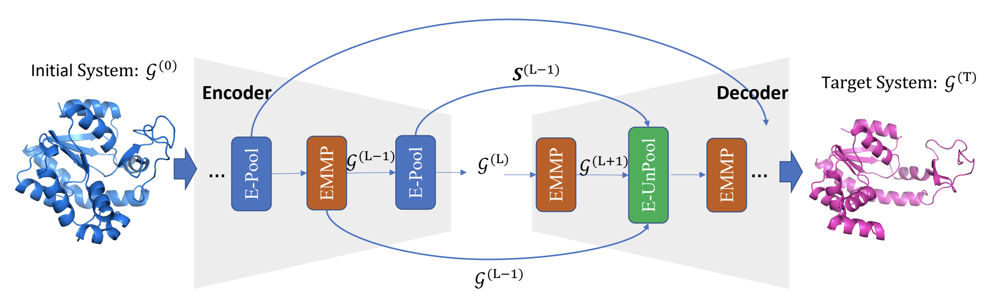

# Equivariant Graph Hierarchy-Based Neural Networks (NeurIPS 2022)

Jiaqi Han, Wenbing Huang, Tingyang Xu, Yu Rong

[](https://github.com/hanjq17/EGHN/blob/main/LICENSE)

[**[Paper]**](https://arxiv.org/pdf/2202.10643.pdf) [**[Poster]**](assets/poster.png)

Equivariant Graph Hierarchy-Based Neural Networks (EGHNs) are novel graph networks that incorporate automatic hierarchical modeling into equivariant GNNs. The model performs promisingly on various types of complex physical/biochemical systems (e.g., proteins dynamics) by achieving lower simulation error while producing visually interpretable cluster assignments as well. Please refer to our paper for more details.



## Dependencies

```
python==3.8.10
torch==1.8.0
torch-geometric==2.0.1
scikit-learn==0.24.2
networkx==2.5.1
```
You may also need `mdanalysis` if you want to process the protein MD data.


## Data Preparation

**1. Simulation dataset**

Under `simulation/datagen` path, run the following command:

```python
python -u generate_dataset.py --num-train 5000 --seed 43 --n_complex 5 --average_complex_size 3 --system_types 5
```

where `n_complex` is the number of complexes $M$, `average_complex_size` is the size of  each complex in expectation, and `system_types` indicate the total number of system types.

**2. Motion capture dataset**

We provide our pre-processed dataset as well as the splits in `motion/dataset` folder, which can also be found in the repo of [GMN](https://github.com/hanjq17/GMN).

**3. Protein MD**

We provide the data preprocessing code in `mdanalysis/preprocess.py`. One can simply run

```python
python mdanalysis/preprocess.py
```

after setting the correct data path specified as the variable `tmp_path` in `preprocess.py`.


## Model Training

**1. Simulation dataset**

```bash
sh start_simulation.sh
```

**2. Motion capture**

```bash
sh start_mocap.sh
```

**3. Protein MD**

```bash
sh start_md.sh
```


## Evaluation

For Simulation and Motion datasets, the evaluation (validation and testing) is conducted along with training. For protein MD, we extra offer an evaluation script:

**Protein MD**

```bash
sh start_eval_mdanalysis.sh
```

## Citation
Please consider citing our work if you find it useful:
```
@inproceedings{
han2022equivariant,
title={Equivariant Graph Hierarchy-Based Neural Networks},
author={Jiaqi Han and Wenbing Huang and Tingyang Xu and Yu Rong},
booktitle={Advances in Neural Information Processing Systems},
year={2022},
url={https://openreview.net/forum?id=ywxtmG1nU_6}
}
```

## Contact

If you have any question, welcome to contact me at:

Jiaqi Han: alexhan99max@gmail.com
